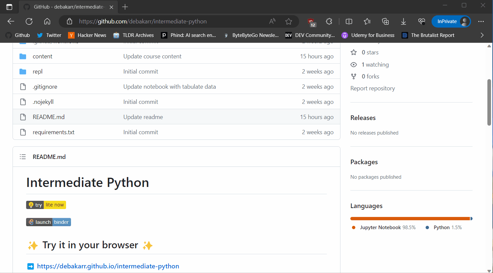
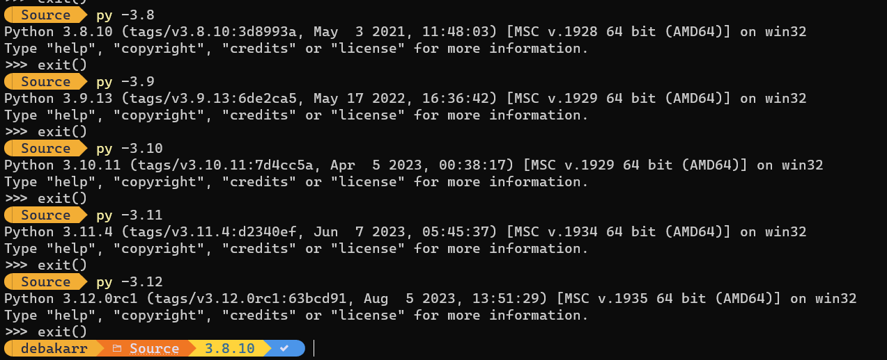
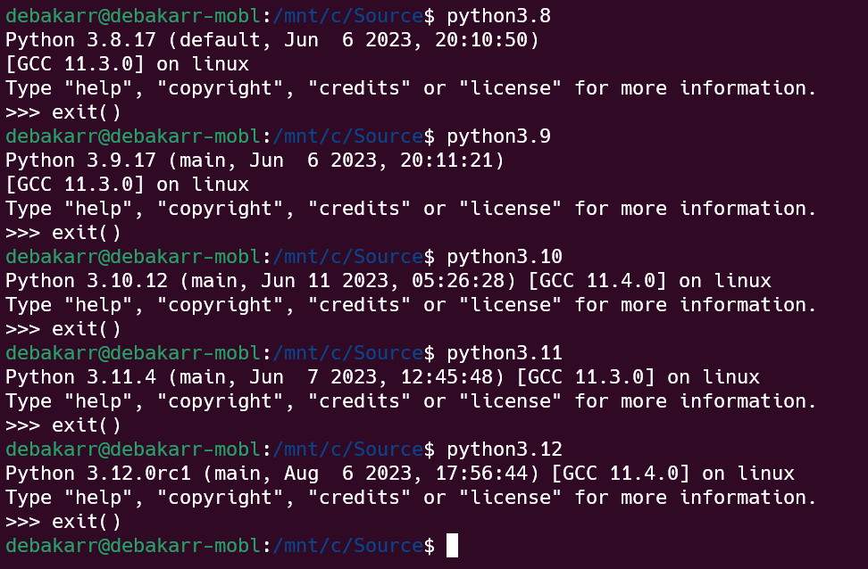

# Advance Python - Pythonic Programming

[](https://github.com/debakarr/pythonic-programming)

[](https://mybinder.org/v2/gh/debakarr/pythonic-programming/HEAD)

[](https://colab.research.google.com/github/debakarr/pythonic-programming)

## ✨ Try it in your browser ✨

➡️ **https://debakarr.github.io/pythonic-programming**



---

## Try from local environment

1. Make sure you have Python installed. Follow the guide in the official Python documentation on how to do it for different operating systems: [Windows](https://docs.python.org/3/using/windows.html#installation-steps), [Mac](https://docs.python.org/3/using/mac.html#getting-and-installing-macpython), or [Unix](https://docs.python.org/3/using/unix.html#getting-and-installing-the-latest-version-of-python) systems. 
2. Considering you have Git installed. Try cloning this repository: `git clone https://github.com/debakarr/pythonic-programming.git`
3. I would recommend creating a `virtual environment` to install the dependencies: 
    - In Windows: `py -3.8 -m venv .venv`
    - In Linux: `python3.8 -m venv .venv`
4. Activate virtual environment: 
    - In Windows `.venv\Scripts\activate` 
    - In Linux `source .venv/bin/activate`
5. Install all the dependencies in the virtual environment: `pip install -r requirements.txt`
6. Run Jupyter Lab: `jupyter lab`

You can also use [`uv`](https://github.com/astral-sh/uv) to set up virtual environment and run the notebook locally.

<details><summary>Using uv</summary>

```console
$ uv venv -p 3.8
Using Python 3.8.10 interpreter at C:\Python38\python.exe
Creating virtualenv at: .venv
$ .\.venv\Scripts\activate
$ uv pip install -r .\requirements.txt
Resolved 149 packages in 1.15s
Downloaded 22 packages in 6.61s
Installed 149 packages in 5.24s
 + anyio==4.2.0
 + argon2-cffi==23.1.0
 + argon2-cffi-bindings==21.2.0
 + arrow==1.3.0
 + asttokens==2.4.1
 + async-lru==2.0.4
 + attrs==23.2.0
 + babel==2.14.0
 + backcall==0.2.0
 + beautifulsoup4==4.12.3
 + black==24.2.0
 + bleach==6.1.0
 + bqplot==0.12.42
 + branca==0.7.1
 + certifi==2024.2.2
 + cffi==1.16.0
 + charset-normalizer==3.3.2
 + click==8.1.7
 + cloudpickle==3.0.0
 + colorama==0.4.6
 + comm==0.2.1
 + contourpy==1.1.1
 + cycler==0.12.1
 + debugpy==1.8.1
 + decorator==5.1.1
 + defusedxml==0.7.1
 + doit==0.36.0
 + exceptiongroup==1.2.0
 + executing==2.0.1
 + fastjsonschema==2.19.1
 + flake8==7.0.0
 + fonttools==4.49.0
 + fqdn==1.5.1
 + idna==3.6
 + importlib-metadata==7.0.1
 + importlib-resources==6.1.1
 + iniconfig==2.0.0
 + ipycanvas==0.13.1
 + ipyevents==2.0.2
 + ipykernel==6.29.2
 + ipyleaflet==0.18.2
 + ipympl==0.9.3
 + ipython==8.12.3
 + ipython-genutils==0.2.0
 + ipywidgets==8.1.2
 + isoduration==20.11.0
 + jedi==0.19.1
 + jinja2==3.1.3
 + json5==0.9.14
 + jsonpointer==2.4
 + jsonschema==4.21.1
 + jsonschema-specifications==2023.12.1
 + jupyter-client==8.6.0
 + jupyter-core==5.7.1
 + jupyter-events==0.9.0
 + jupyter-lsp==2.2.2
 + jupyter-server==2.12.5
 + jupyter-server-terminals==0.5.2
 + jupyterlab==4.0.12
 + jupyterlab-fasta==3.3.0
 + jupyterlab-geojson==3.4.0
 + jupyterlab-language-pack-fr-fr==4.0.post7
 + jupyterlab-language-pack-zh-cn==4.0.post7
 + jupyterlab-miami-nights==0.4.1
 + jupyterlab-night==0.4.6
 + jupyterlab-pygments==0.3.0
 + jupyterlab-server==2.25.3
 + jupyterlab-widgets==3.0.10
 + jupyterlite-core==0.2.3
 + jupyterlite-javascript-kernel==0.2.3
 + jupyterlite-p5-kernel==0.1.0
 + jupyterlite-pyodide-kernel==0.2.3
 + jupyterlite-xeus-lua==0.3.1
 + jupyterlite-xeus-sqlite==0.2.1
 + kiwisolver==1.4.5
 + markupsafe==2.1.5
 + matplotlib==3.7.5
 + matplotlib-inline==0.1.6
 + mccabe==0.7.0
 + mistune==3.0.2
 + mypy-extensions==1.0.0
 + nbclient==0.9.0
 + nbconvert==7.16.0
 + nbformat==5.9.2
 + nest-asyncio==1.6.0
 + notebook==7.0.8
 + notebook-shim==0.2.4
 + numpy==1.24.4
 + overrides==7.7.0
 + packaging==23.2
 + pandas==2.0.3
 + pandocfilters==1.5.1
 + parso==0.8.3
 + pathspec==0.12.1
 + pickleshare==0.7.5
 + pillow==10.2.0
 + pkginfo==1.9.6
 + pkgutil-resolve-name==1.3.10
 + platformdirs==4.2.0
 + plotly==5.19.0
 + pluggy==1.4.0
 + prometheus-client==0.20.0
 + prompt-toolkit==3.0.43
 + psutil==5.9.8
 + pure-eval==0.2.2
 + pycodestyle==2.11.1
 + pycodestyle-magic==0.5
 + pycparser==2.21
 + pyflakes==3.2.0
 + pygments==2.17.2
 + pyparsing==3.1.1
 + pytest==8.0.1
 + python-dateutil==2.8.2
 + python-json-logger==2.0.7
 + pytz==2024.1
 + pywin32==306
 + pywinpty==2.0.12
 + pyyaml==6.0.1
 + pyzmq==25.1.2
 + referencing==0.33.0
 + requests==2.31.0
 + rfc3339-validator==0.1.4
 + rfc3986-validator==0.1.1
 + rpds-py==0.18.0
 + send2trash==1.8.2
 + six==1.16.0
 + sniffio==1.3.0
 + soupsieve==2.5
 + stack-data==0.6.3
 + tenacity==8.2.3
 + terminado==0.18.0
 + tinycss2==1.2.1
 + tokenize-rt==5.2.0
 + tomli==2.0.1
 + tornado==6.4
 + traitlets==5.14.1
 + traittypes==0.2.1
 + types-python-dateutil==2.8.19.20240106
 + typing-extensions==4.9.0
 + tzdata==2024.1
 + uri-template==1.3.0
 + urllib3==2.2.1
 + wcwidth==0.2.13
 + webcolors==1.13
 + webencodings==0.5.1
 + websocket-client==1.7.0
 + widgetsnbextension==4.0.10
 + xyzservices==2023.10.1
 + zipp==3.17.0
```

</details>

---
This course is targeted for developers who have already intermediate experience with Python and want to level up to advance level.

Course is delivered by **Roy, Debakar**.

## Expectation/Pre-requisite

You should already have knowledge of:
- Python fundamentals (identifier, data types, loops, functions, OOP).
- [Python intermediate](https://github.com/debakarr/intermediate-python) (decorator, lambda, typing, generator, iterator).
- If you are new to Python, consider completing a beginner and intermediate Python course first.
- We assume that we are on Python 3.8+
- Git (In case you want to clone this repo and run it locally).

## What can you expect?

Discover the essence of Pythonic programming in this concise course designed to elevate your coding skills. Learn the fundamentals of clean and efficient code.

The objective of this class is to equip you with a collection of refined code snippets. These can be utilized to systematically review your entire codebase, replacing instances of less idiomatic code with more idiomatic alternatives as indicated during the discourse. 

## Which Python version are we using?

<div style="text-align: center"><strong>Python3.8+</strong></div>

| Branch | Schedule                                       | Status        | First release | End of life  | Release manager       |
| ------ | ---------------------------------------------- | ------------- | ------------- | ------------ | --------------------- |
| main   | [PEP 719](https://peps.python.org/pep-0719/)   | feature       | _2024-10-01_  | _2029-10_    | Thomas Wouters        |
| 3.12   | [PEP 693](https://peps.python.org/pep-0693/)   | prerelease    | _2023-10-02_  | _2028-10_    | Thomas Wouters        |
| 3.11   | [PEP 664](https://peps.python.org/pep-0664/)   | bugfix        | 2022-10-24    | _2027-10_    | Pablo Galindo Salgado |
| 3.10   | [PEP 619](https://peps.python.org/pep-0619/)   | security      | 2021-10-04    | _2026-10_    | Pablo Galindo Salgado |
| 3.9    | [PEP 596](https://peps.python.org/pep-0596/)   | security      | 2020-10-05    | _2025-10_    | Łukasz Langa          |
| 3.8    | [PEP 569](https://peps.python.org/pep-0569/)   | security      | 2019-10-14    | _2024-10_    | Łukasz Langa          |
| ~3.7~  | ~[PEP 537](https://peps.python.org/pep-0537/)~ | ~end-of-life~ | ~2018-06-27~  | ~2023-06-27~ | ~Ned Deily~           |

<div style="text-align: center"><a href="https://devguide.python.org/versions/">Source for the above table</a></div>

## Running different Python version in Windows



## Running different Python version in Linux


